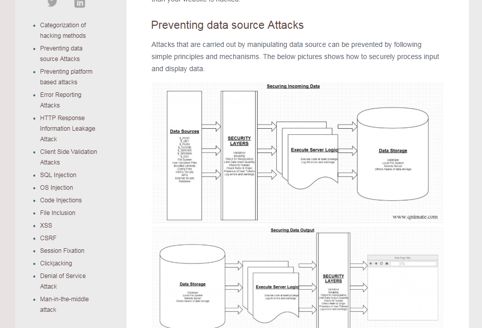

http://qnimate.com/common-web-vulnerabilities/#prettyPhoto

 

Website Hacking Methods and their Prevention
web security
Do you know that one website is hacked every 5 seconds and also 63% of website owners don’t know that they are hacked. You might be the next or you are already a victim. Protecting user and business critical information is the first job of a developer. This post will help you to survive the cyber war.

In this post we will see the ways by which a hacker can hack your website and also how you can stop your website from getting hacked. Let’s get started.

Categorization of hacking methods
Methods to hack a website are divided into two categories. First category includes hacking a website by manipulating the data sources and the second category includes hacking the platform on which the website runs.

Many website are poorly written which fails to handles manipulated data and ultimately the website gets hacked.

By the platform we mean Operating System, DNS Servers, Network, Web Server, Server Language, FTP, SSH, SSL etc., on which the website runs. If any of this things are hacked than your website is hacked.

Preventing data source Attacks
Attacks that are carried out by manipulating data source can be prevented by following simple principles and mechanisms. The below pictures shows how to securely process input and display data.

data input attack
data output attack

Its not limited to this. You can create more security layers to protect your and users critical information.

Preventing platform based attacks
Its the job of third party companies to protect their software and hardware on top of which our website runs. But still we can do a lot to secure our website from platform based attacks. The below picture shows some common things you need to carry put to protect your website from platform based attacks.

platform based attacks

There are a lot more things you can do to prevent these kinds of attacks.

Now on we will look at some common ways by which by which hackers hack websites. All examples and theory I show on this post are valid for web server as apache and server language as php And next to valid for other technologies.

Error Reporting Attacks
A hacker can submit manipulated data to the server which can sometimes trigger error messages if server scripts fail to handle this kinds of data manipulation. This error messages leak information like directory names, server name, software version and a lot of other things.

Let’s see an example of this kind of poorly written scripts:
index.php

<?php
  echo $_GET["number"];//Hacker can request this url without passing query string.
?>
Now when you run this script you will get this error.
hack1
This error leaks a lot of information. Some information it leaks are

Website runs on windows operation system
Web server is wamp
File system path to the index.php file
Now hacker can gather this information and try to exploit these software’s to hack our website.

The best solution to this problem is to log errors instead of displaying errors. So that only the administrators can see the errors and hacker don’t get any information.

There are many ways to disable error displaying and enabling error logging.

First method:
php.ini

display_errors = Off 
display_startup_errors = Off
error_reporting = E_ALL&~E_DEPRECATED
html_errors = Off
log_errors = On
error_log = "/filesystem/path/to/log/file/filename.log"
Second method:
.htaccess

#put this in root directory
php_flag display_errors Off
php_flag display_startup_errors Off
php_value error_reporting E_ALL&~E_DEPRECATED
php_flag html_errors Off
php_flag log_errors On
php_value error_log  /filesystem/path/to/log/file/filename.log
Third method:
index.php

ini_set("error_reporting", E_ALL&~E_DEPRECATED);
ini_set("display_errors", "Off");
ini_set("log_errors", "On");
ini_set("display_startup_errors", "Off");
ini_set("html_errors", "Off");
ini_set("error_log", "/filesystem/path/to/log/file/filename.log");
Now when we see our errors in log we will know that there is no validation check for this variable and we will rectify our mistake by modifying the script. To prevent this kids of errors we can do simple validation as shows below.

index.php

<?php

  if(isset($_GET["number"]){
    echo $_GET["number"];
  }
  else{
    echo "Variable not set";
  }
?>
***Always disable error display and enable error logging for production use. From now on I will assume that you have disabled error displaying.

HTTP Response Information Leakage Attack
HTTP Response headers can also leak a lot of information about our website which can be used by hackers to hack our website.

HTTP Response Headers which leak information are:

Server: This header leaks OS name, web server name, server language name, versions and some other things.
X-Powered-By: This header leaks the name and version of server side language.
This information is very critical and can be used by the hacker to hack your website.

We can stop web server from leaking this information by changing some variable values in httpd.conf and php.ini files.

httpd.conf

ServerTokens Prod
ServerSignature Off
php.ini

expose_php = Off
Client Side Validation Attacks
Never depend on client side validation. Hackers can easily bypass it and can do a lot of things to hack your website.

Lets see a demo of how to break client side validation and hack a website.

index.php

<!doctype html>
<html>
<body>
    <form action="/" method="POST">
        QNimate Subscription 
        E-Mail: <input style="width: 200px;" name="email" type="email" required>
        <input type="submit"> 
    </form>
</body>
</html>

<?php
    if(isset($_POST["email"]))
    {
        if(file_exists("emails.txt"))
        {
            $emails = file_get_contents("emails.txt");
        }
        else
        {
            $emails = "";
        }
        $emails = $emails . "\n" . $_POST["email"];
        file_put_contents("emails.txt", $emails);
        echo $emails;
    }
?>
This script looks absolutely fine and works well. But a attacker can easily inspect the HTML source code And remove “required” field and change “email” type to “text”. Now the the HTML code on client side will look something like this

<!doctype html>
<html>
<body>
    <form action="/" method="POST">
        QNimate Subscription 
        E-Mail: <input style="width: 200px;" name="email" type="text">
        <input type="submit"> 
    </form>
</body>
</html>
Now the hacker can insert any random text in the email field and submit it instead of inserting a email address. Something like this:

hack2

And now hacker has broken your validation layers and can insert random text which you don’t want and now your website is vulnerable to spams. We can also do very powerful things like XSS attacks. We will learn more about XSS attacks in later sections.

We can prevent such attacks by validating the form data on server side also. Here we can change the code to this

<!doctype html>
<html>
<body>
    <form action="/" method="POST">
        E-Mail Registration for QNimate Subscription 
        E-Mail: <input style="width: 200px;" name="email" type="email" required>
        <input type="submit"> 
    </form>
</body>
</html>

<?php
    if(isset($_POST["email"]))
    {
        if(!filter_var($_POST["email"], FILTER_VALIDATE_EMAIL))
        {
            echo "E-mail is not valid";
        }
        else
        {
            if(file_exists("emails.txt"))
            {
                $emails = file_get_contents("emails.txt");
            }
            else
            {
                $emails = "";
            }
            $emails = $emails . "\n" . $_POST["email"];
            file_put_contents("emails.txt", $emails);
            echo $emails;
        }
    }
    else
    {
        if(file_exists("emails.txt"))
        {
            echo file_get_contents("emails.txt");   
        }   
    }
?>
SQL Injection
SQL injection is a technique where hackers can inject SQL commands into an SQL statements, via data sources.

Let’s see an example:

index.php

<!doctype html>
<html>
<body>
    <form action="/" method="POST">
        Contact QNimate 
        E-Mail:  <input style="width: 200px;" name="email" type="email" required> 
        Message:  <textarea style="height: 200px; width: 200px;" name="message"></textarea> 
        <input type="submit"> 
    </form>
</body>
</html>

<?php
    
    if(isset($_POST["email"]) && isset($_POST["message"])){
        //we will construct the SQL statement and print it.
        $sql = "INSERT INTO contacts ('email', 'message') VALUES('" . $_POST["email"] . "', '" . $_POST["message"] . "');";
        echo $sql; //assume this code is executed.
    }
?>
The above code is vulnerable to SQL injection. A user can append an SQL code inside the email or message field and hack your website.

This is an example sql code a hacker can inject:
hack1
Now when the form is submitted the server will execute this SQL statement.

INSERT INTO contacts ('email', 'message') VALUES('abc@qnimate.com', 'hacked'); drop table contacts; -- ');
which will result in deleting the whole contacts table. So your website is hacked.

SQL injection attacks can be stopped by validating data, escaping data and running SQL code at low privilege. If we would have executed the above sql statement at low privilege than it wouldn’t have been able to delete the table. So we can change the script to this

<!doctype html>
<html>
<body>
    <form action="/" method="POST">
        Contact QNimate 
        E-Mail:  <input style="width: 200px;" name="email" type="email" required> 
        Message:  <textarea style="height: 200px; width: 200px;" name="message"></textarea> 
        <input type="submit"> 
    </form>
</body>
</html>

<?php
    
    if(isset($_POST["email"]) && isset($_POST["message"])){

        if(is_string($_POST["email"]) and is_string($_POST["email"]) and filter_var($_POST["email"], FILTER_VALIDATE_EMAIL))//check data type and format
        {
            $mysqli = new mySqli('hostname', 'db_username', 'db_password', 'db_name');
            //we will construct the SQL statement and print it. real_escape_string prepends backslashes to the following characters: \x00, \n, \r, \, ', " and \x1a
            $sql = "INSERT INTO contacts ('email', 'message') VALUES('" . $mysqli->real_escape_string($_POST["email"]) . "', '" . $mysqli->real_escape_string($_POST["message"]) . "');";
            echo $sql;//execute code at low provilege
        }
    }
?>
Always remember to validate(string format and data type) and escape data And run SQL code at low privilege level.

OS Injection
OS injection is a technique where hackers can run OS command on server by injecting command to data sources.

Let’s see an example in which a website allows user to find ip of a domain name.
index.php

<!doctype html>
<html>
<body>
    <form action="/" method="POST">
        Domain Name
        <input type="text" name="domain_name">
        <input type="submit" value="nslookup"> 
    </form>
</body>
</html>

<?php
    if(isset($_POST["domain_name"]))
    {
        system("nslookup " . $_POST["domain_name"]);
    }
?>
The above script is vulnerable to OS injection. A hacker can execute multiple other commands on server in this way
hack1

Now submitting this form will display all folders and files of the parent directory of the web root directory. In this way a hacker can execute almost any command and destroy your web site.

This kind of attacks can be prevented by data validation and running commands on server scripts with least privilege.

So we can change the script to this

<!doctype html>
<html>
<body>
    <form action="/" method="POST">
        Domain Name
        <input type="text" name="domain_name">
        <input type="submit" value="nslookup"> 
    </form>
</body>
</html>

<?php

    function is_domain($domain)
    {
        //domain, sub domain, top level domain
        return preg_match('/^ (?: [a-z0-9] (?:[a-z0-9\-]* [a-z0-9])? \. )*[a-z0-9] (?:[a-z0-9\-]* [a-z0-9])?\.[a-z]{2,6}$/ix', $domain);   
    }

    if(isset($_POST["domain_name"]) && is_domain($_POST["domain_name"]))
    {
        system("nslookup " . $_POST["domain_name"]);
    }
?>
Code Injections
Code Injection is a technique by which a hacker can execute code on the web server by injecting code to the data sources.

Let’s see an example of this:
index.php

<!doctype html>
<html>
<body>
    <form action="/" method="POST">
        Domain Name
        <input type="text" name="number1">
        <input type="text" name="number2">
        <input type="submit"> 
    </form>
</body>
</html>

<?php
    if(isset($_POST["number1"]) && isset($_POST["number2"]))
    {
        eval("echo ". $_POST["number1"] . "+" . $_POST["number2"] .";");
    }
?>
The above script takes two numbers and creates a php code string and passing it to eval() for execution. The above script is vulnerable to code injection. A hacker can inject any php code and make it execute on the server.

This is how a hacker can inject code:

hack1

Now when the form is submitted all the information about your server is leaked.

You can prevent this kinds of code injection attacks by preventing use of eval() or validating the data. So we can change the script to this

<!doctype html>
<html>
<body>
    <form action="/" method="POST">
        Domain Name
        <input type="text" name="number1">
        <input type="text" name="number2">
        <input type="submit"> 
    </form>
</body>
</html>

<?php
    if(isset($_POST["number1"]) && isset($_POST["number2"]))
    {
        if(is_numeric($_POST["number1"]) && is_numeric($_POST["number2"]))
        {
            eval("echo ". $_POST["number1"] . "+" . $_POST["number2"] .";");
        }
    }
?>
Its always better to avoid use of eval().

File Inclusion
File inclusion is a technique by where a hacker can runs a remote or local script on the web server.

Let’s see an example of this:
index.php

<!doctype html>
<html>
<body>
    <form action="/" method="POST">
        Enter a theme color:
        <select name="color">
          <option value="green">green</option>
          <option value="blue">blue</option>
          <option value="red">red</option>
          <option value="yellow">yellow</option>
        </select>
        <input type="submit"> 
    </form>
</body>
</html>

<?php
    if(isset($_POST["color"]))
    {
        include($_POST["color"] . ".php");
    }
?>
The above code works fine by including a script related to the theme color of web site. But a hacker can easily exploit it and run any code on web server.

A hacker can inspect the html source code and pass value for color as .htaccess. Below picture shows a simple exploit of the above code

hack1

Now when the form is submitted the web page will display our .htaccess configuration file. Similarly you can change the value to any remote file link or local file link which will cause its execution.

This can be prevented by data validation. So we can change our script to this

<!doctype html>
<html>
<body>
    <form action="/" method="POST">
        Enter a theme color:
        <select name="color">
          <option value="green">green</option>
          <option value="blue">blue</option>
          <option value="red">red</option>
          <option value="yellow">yellow</option>
        </select>
        <input type="submit"> 
    </form>
</body>
</html>

<?php
    if(isset($_POST["color"]) && ($_POST["color"] == "green" || $_POST["color"] == "blue" || $_POST["color"] == "red" || $_POST["color"] == "yellow"))
    {
        include($_POST["color"] . ".php");
    }
?>
Always be careful and validate data before using include(), file_get_contents() and require() in php to prevent file inclusion attacks.

XSS
XSS (Cross Site Scripting) is a technique by which a hacker injects client-side script into Web pages viewed by other users. This kinds of attacks are very common and needs to be dealt properly.

Let’s see an example of this kind of attacks:
index.php

<!doctype html>
<html>
<body>
    <form action="/" method="POST">
        Post Comment:  
        <input type="text" style="width: 300px;" name="comment">
        <input type="submit">
    </form>
     

<?php
    if(isset($_POST["comment"]))
    {
        $comment = $_POST["comment"];

        if(file_exists("comments.txt"))
        {
            $comments = file_get_contents("comments.txt");
            $comments = $comments . $comment;
            file_put_contents("comments.txt", $comments);
            echo file_get_contents("comments.txt");
        }
        else
        {
            file_put_contents("comments.txt", $comment);
            echo file_get_contents("comments.txt");
        }
    }
?>

</body>
</html>
A hacker can easily exploit this script and cause a code to run on client side. Putting script code or html source code inside the comment field will lead to XSS attack. Below image shows how a hacker can exploit it.

hack1

Now once this form is submitted, anyone who visits the site will see a alert box with a message “Hacked!!!”.

This kinds of attacks can be prevented by escaping the stored output. So we can change the script to this:

<!doctype html>
<html>
<body>
    <form action="/" method="POST">
        Post Comment:  
        <input type="text" style="width: 300px;" name="comment">
        <input type="submit">
    </form>
     

<?php
    if(isset($_POST["comment"]))
    {
        $comment = $_POST["comment"];

        if(file_exists("comments.txt"))
        {
            $comments = file_get_contents("comments.txt");
            $comments = $comments . $comment;
            file_put_contents("comments.txt", $comments);
            echo htmlentities(file_get_contents("comments.txt"));
        }
        else
        {
            file_put_contents("comments.txt", $comment);
            echo htmlentities(file_get_contents("comments.txt"));
        }
    }
?>

</body>
</html>
CSRF
CSRF (Cross Site Request Forgery) is a type of attack in which requests from user are sent to servers without the user knowing about it.

This kinds of attack are very popular in the internet. Let’s look at an example of this kinds of attacks.

index.php

<form method="POST" action="money_transfer.php">
    <input type="text" name="from">
    <input type="text" name="to">
    <input type="text" name="amount_in_dollars">
    <input type="submit">
</form>
money_transfer.php

if(isset($_FORM["form"]) && isset($_FORM["to"]) && isset($_FORM["amount_in_dollars"]) && isset($_COOKIE["user_logged_in"]))
{
    transMoney("from", "to", "amount");
    echo "Money transfer done";
}
The above code uses cookie to check if the user is logged in or not. If user is logged in then the money transfer is done. This scripts are vulnerable to CSRF attacks. A hacker can embed the above form in any website and send the link to the users and forcing some way to click on it. If the cookie is present then the money will be transfer to the hackers account.

Let’s see how this can be done (assume that user is logged in into bank website):
http://hackersite.com/earnmoney.html

<form method="POST" action="http://bank.com/money_transfer.php">
    <input type="text" name="from" value="username" style="display: hidden">
    <input type="text" name="to" value="hackername" style="display: hidden">
    <input type="text" name="amount_in_dollars" value="100000" style="display: hidden">
    <input type="submit" value="Click here to get $100000000 dollars">
</form>
This page link can be send to a user who is using bank website. And if the user clicks on the submit button on hackers website the given amount will be transferred which will lead to a disaster. So websites should’t depend on cookies to do critical things.

There are many ways to prevent such kinds of attacks. We will see the best and popular ones.
This kinds of attacks can be prevented by using HTTP Referer header, extra verification step or using special token

Lets see all the above preventing methods.

Preventing CSRF using HTTP Referer

if(isset($_FORM["form"]) && isset($_FORM["to"]) && isset($_FORM["amount_in_dollars"]) && isset($_COOKIE["user_logged_in"]) )
{
    //HTTP Referer is the address of the page (if any) which referred the user agent to the current page.
    if($_SERVER['HTTP_REFERER'] == "http://www.bank.com/")
    {
        transMoney("from", "to", "amount");
        echo "Money transfer done";
    }
}
Some browser allow to change HTTP Referer while requesting a link and also there are many other ways to change or break HTTP referer. So this method should be used along with other methods.

Preventing CSRF using special tokens

<form method="POST" action="money_transfer.php">
    <input type="text" name="from">
    <input type="text" name="to">
    <input type="text" name="amount_in_dollars">
    <input type="text" name="secrettoken" style="display: hidden" value="secret_token_number">
    <input type="submit">
</form>
<?php
    
if(isset($_FORM["form"]) && isset($_FORM["to"]) && isset($_FORM["amount_in_dollars"]) && isset($_COOKIE["user_logged_in"]) )
{
    if($_SERVER['HTTP_REFERER'] == "http://www.bank.com/" && user_token_matches($_FORM["secrettoken"]) && is_not_expired($_FORM["secrettoken"]))
    {
        transMoney("from", "to", "amount");
        echo "Money transfer done";
    }
}

?>
Every user will have a random secret token assigned to them whenever they make a request for the form and the token will be encrypted and hidden in the form. This token can only be used once and a new token is generated for every user for every new request for the form. And this token will have a expiry time of few minutes. While submitting the form, the form must have the user secret token. There is no way a hacker can find out the secret token of a user so cross site form submissions will not work.

There are many other factors that can be considered while generating this kind of tokens, this method is an simple and full proved way.

Extra Validation
You can use some extra validation steps before transfer money. These steps can be CAPTCHA validation, Re-Authentication (of password), DOB, mobile message verification etc.

By combining the above three methods we can get the best security possible against CSRF attacks.

Session Fixation
Session Fixation is a hacking technique by which a hacker can hijack a valid user session. There are many ways to hijack user sessions. Sometimes this happens by mistake or sometimes knowingly.

When cookies are disabled by browser, php passes session ids via GET. This is very dangerous. As you can sometime by mistake send this URL (URL containing session id) to a friend and he will hijacks your session by mistake. To prevent this kind of mistake session hijacking you can disable the passing of session id via GET.

This can be done in php.ini file.
php.ini

session.use_only_cookies = 1
A hacker can steal your session id by intercepting traffic between user browser and web server. To prevent this you need to encrypt your website communication with server via SSL. So the hacker cannot steal it. A hacker can also hijack session by XSS attack. So preventing XSS attacks will also prevent session fixation.

Always regenerate session id on every request to the website so that a hijacked session id (if hacker has already hijacked in some other way) will become invalid. You can regenerate session id by using this function

session_regenerate_id();
You need to destroy the existing session whenever user logs out of your website.

session_destroy();
These are some ways by which you can protect your website from session fixation.

Clickjacking
Clickjacking is a technique by which a attacker uses multiple transparent or opaque layers to trick a user into clicking on a button or link on another page when they were intending to click on the the top level page. Thus, the attacker is “hijacking” clicks meant for their page and routing them to other another page, most likely owned by another application, domain, or both.

Let’s see the steps used by a hacker to achieve clickjacking:

Hacker creates a web page with some buttons on it aligned same as your website.
Loads your website inside a iframe.
Places the iframe on top of his web page.
Make the iframe transparent.
Now you won’t be able to see your website but it lies on top of hacker’s web page.
Users clicking on buttons will think that they are clicking on the normal visible web page buttons. But actually they are click on your website buttons.
This can be prevented by disallowing your website to be viewed inside a iFrame.

You need to insert this response header inside your httpd.conf file.

/*You can set this header value to DENY, SAMEORIGIN or ALLOW-FROM uri */
/*These values work the way they sound.*/
Header always append X-Frame-Options SAMEORIGIN
or you can insert this response header in your .htaccess file

Header append X-FRAME-OPTIONS "SAMEORIGIN"
You can also add this X-FRAME-OPTIONS header using PHP or any other server side language.

This is how you can prevent clickjacking.

Denial of Service Attack
This attack comes under platform based attacks. DOS is a technique by which a hacker consumes all the server resources so that users cannot access the site or the site will become slow. This is done basically by flooding your server with large number of requests.

dos

To prevent this kind of attacks you can use services like cloudflare which provide DOS security to websites. Many hosting services also provide DOS security.

Man-in-the-middle attack
Man-in-the- middle attack is a method by which a hacker can intercept traffic between you and your website And also your website and your users.

man-in-the-middle-attack

Traffic between you and your website can be protected by the use of SSH instead of FTP.

Traffic between your users and website can be protected by using HTTPS instead of HTTP.

Conclusion

In this post I tried to cover all common types of attacks and ways to to prevent them. I will keep updating this post as new techniques arrives. Thanks for reading this post. “Like and Share”

